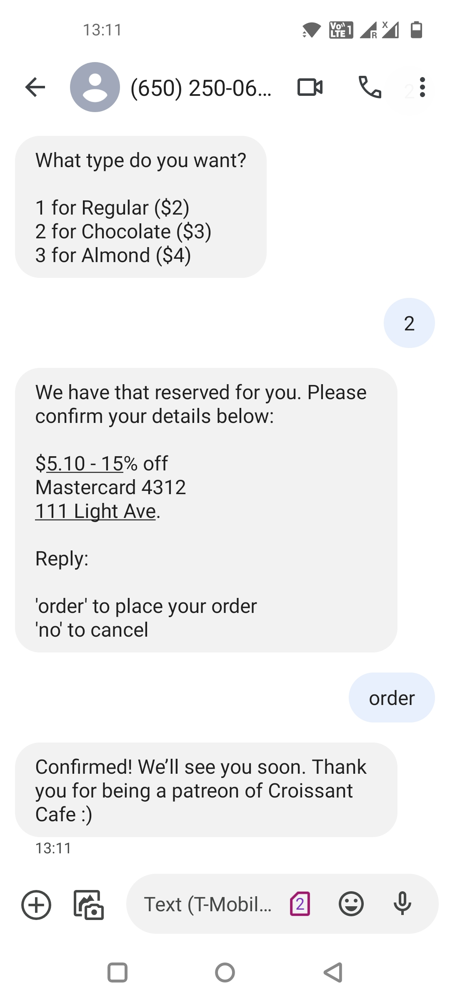

# Text-To-Pay

## Problem

Businesses struggle to get repeat customers and hence there is a need for a system that allows them to create and send marketing messages and offer discounts that help them to increase conversion rates.

It takes the average person 90 minutes to respond to an email, but only 90 seconds to respond to a text message. With technology advancing at rapid speeds, successful businesses have adopted the new way to pay - completely through text.

## What is Text to Pay?

Text to pay, also known as SMS (Short Messaging Service) payment, is a payment solution that allows consumers to make a payment via texting on their smartphones. With this payment method, your customers send out a text to their client's phone stating they can make a payment and have the option to text back “yes” to complete the transaction. The business will have their client's payment information on file so they don’t have to worry about typing in their credit card information each time. If the business does not have their payment information available, there is an option for the client to add their credit card or bank details to the business's system, so that it is on file for future purchases. This process makes for a seamless experience for both your customer’s business as well as for their clients.

## Benefits of Text to Pay for Your Customers

Text-based billing reminders, simple collection statements, and mobile-enabled payment systems provide intelligent solutions to improve on-time payments, reduce collection costs, and build customer confidence. Payments are going mobile, due to the outstanding benefits that come from accepting mobile payments, such as:

- Quickness: Businesses are now able to set up a system where they can automatically send payment options. Then their clients can easily access and confirm or deny the payment with a few taps of a smartphone. Text messages have a 98% open rate, while email has only a 20% open rate, which means the payment reminder will easily be seen and on the top of the client’s mind.

- Convenience: 72% of business professionals prefer texting to other messaging platforms due to the speed and ease of use of a text message. There is no longer a need for clients to call the business to make a payment or pay online and re-enter their card info. We have all been there where we go online to make a payment, then forget our password and have to request a new one to login. It takes up time and effort that your merchant’s clients simply don't have. With SMS messaging, the client simply responds with a “yes” to pay with their card on file via text and they are all set.

- Efficiency: 91% of all U.S. citizens have their mobile device within reach 24/7. This means a person will most likely view their payment reminder much quicker than with another messaging channel, reducing overdue bills and speeding up the time for businesses to get paid. It’s easy for customers to think about paying a bill and getting to it “later,” and then later becomes a missed due date. With automated text reminders and options to pay immediately built into your software, you can minimize that burden for your merchants so they no longer have to worry about collecting late payments.

## How it works

Get paid from any phone number: Text offers to your customers or use our social links to get buyers to text you.

Frictionless buying for existing customers: Repeat customers simply reply Yes to buy, increasing your sales and delivering higher lifetime values.

Onboard new customers easily: We text new users a fast, easy and secure onboarding link. They only need to enter their payment details once. Voilà! Their phone number is now their payment method.

## Demo

I have created a small dry run demo to experience what the buying experience with Text-To-Pay looks like. I have used Twilio for SMS.

You can trigger the flow by scanning either of the above two QR codes and following the steps along. The following screenshots depict the flow for buying croissants at a cafe.

